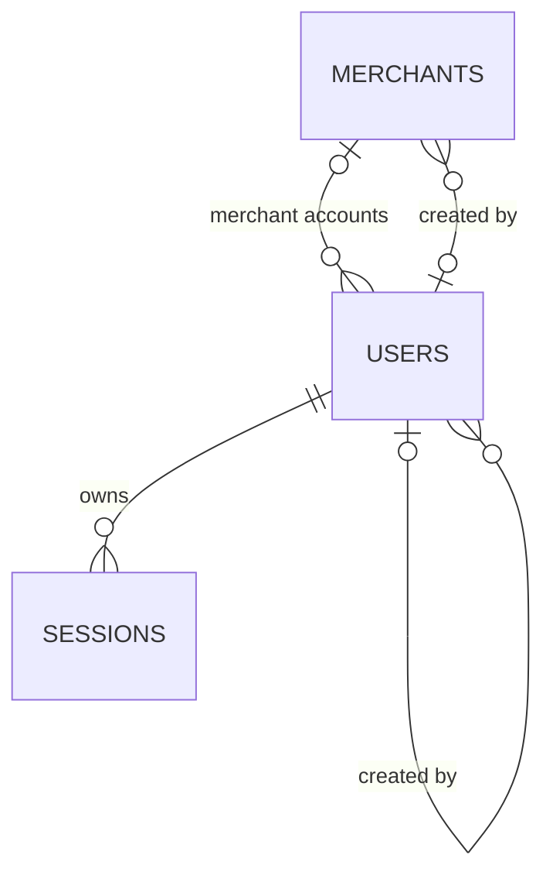

# Blueprint 01 — المستخدمون والتجار والجلسات

**الحالة:** هذه وثيقة مرحلة الهوية الأولى؛ نُفذت بعدها المصادقة والإدارة والأصناف. تحديثات التنفيذ الحالية في آخر الوثيقة وأدلة API المرتبطة.
**المشروع المستهدف لاحقًا:** stocked-backend.  
**التاريخ:** 9 أكتوبر 2026.  
**مرجع المتطلبات:** backend-roadmap.md، الإصدار 2.0.

## 1. الغرض والنطاق

تأسيس هوية المستخدم وملكية التاجر وجلسات قابلة للإبطال بدون Firebase. التصميم يحافظ على مسؤولية محددة لكل جدول، ولا يضيف جداول صلاحيات ديناميكية أو أدوارًا قابلة للتحرير قبل وجود حاجة فعلية.

المرحلة تشمل تعريف UserRole وثلاثة جداول: users وmerchants وsessions. لا تسجيل دخول أو Controllers أو جداول أصناف ومخزون في التنفيذ الأول للشيما. حسابات التفعيل واستعادة كلمة المرور وسجل التدقيق تصمم في بلوبرنتها التالي قبل تنفيذ وظائفها؛ لا نخزن رموزها في أعمدة مستخدم مؤقتة.

## 2. الوضع الحالي ونقطة التغيير

تحققنا من المصدر: prisma/schema.prisma يحتوي فقط على generator وdatasource؛ prisma7.config.ts يقرأ DATABASE_URL. لا نماذج أعمال حاليًا. NestJS مشروع بداية، والاتصال المحلي بـPostgreSQL اجتاز اختبار SELECT 1 وفق نتيجة المستخدم. لا خريطة Graphify للباك إند الحالي؛ الفحص اقتصر على ملفات الإعداد اللازمة.

التدفق الحالي: Prisma CLI → إعداد الاتصال → PostgreSQL؛ هذا لا يثبت وجود خدمة قاعدة بيانات داخل NestJS بعد.

التدفق المستهدف لاحقًا: HTTP → جلسة صالحة → صلاحية ونطاق مستخدم → Service → Repository → PostgreSQL. هذه المرحلة تغير تعريف البيانات فقط بعد اعتمادها، ولا تنشئ ذلك التدفق البرمجي.

## 3. المصطلحات والعلاقات

- User هو حساب شخص، وليس تاجرًا أو سجل بضائع.
- Merchant هو الجهة المالكة للبضائع. يمكن أن تملك عدة حسابات قراءة.
- Session هي دخول فعّال على جهاز/متصفح، وليست كلمة مرور ولا رمز استعادة.
- UserRole enum بقيم ADMIN وWAREHOUSE_KEEPER وEMPLOYEE وMERCHANT؛ القيم المعروضة بالعربية في الواجهة منفصلة عن تخزينها.

العلاقات:



كل حساب MERCHANT يتبع تاجرًا واحدًا. الحساب الداخلي لا يتبع تاجرًا. كل Session تتبع مستخدمًا واحدًا ولا تحفظ نسخة من دوره أو merchantId كي لا تصبح الصلاحيات قديمة.

## 4. جدول merchants — الجهة المالكة

| الحقل في Prisma | عمود SQL | النوع | القاعدة |
|---|---|---|---|
| id | id | UUID | مفتاح أساسي يولده الخادم/القاعدة |
| code | code | varchar(8) | إلزامي وفريد؛ 2–8 حروف A–Z؛ ثابت بعد الإنشاء |
| name | name | varchar(200) | إلزامي، غير فارغ بعد إزالة الفراغات الطرفية |
| phone | phone | varchar(32) | إلزامي كنص؛ لا يتحول إلى رقم |
| isActive | is_active | boolean | true افتراضيًا |
| createdById | created_by_id | UUID | إلزامي؛ علاقة users، حذف مرفوض |
| createdAt | created_at | timestamptz(3) | وقت القاعدة، إلزامي |
| updatedAt | updated_at | timestamptz(3) | وقت تحديث من الخادم، إلزامي |

Unique على code يمنع إعادة استخدام رمز تاجر معطل. التحقق من uppercase في خدمة الإنشاء لاحقًا، وCHECK بقاعدة البيانات يرفض التخزين المخالف. Trigger يمنع تغيير code بعد الإنشاء. لا نسمي name فريدًا؛ قد تتشابه الأسماء. لا حذف فعلي للتاجر.

لا عداد أكواد أصناف هنا؛ يوضع في جدول مستقل عند تصميم الأصناف كي لا نضيف مسؤولية إدارة الكود إلى سجل التاجر الآن.

## 5. جدول users — حساب الشخص

| الحقل في Prisma | عمود SQL | النوع | القاعدة |
|---|---|---|---|
| id | id | UUID | مفتاح أساسي |
| email | email | varchar(254) | إلزامي وفريد، محفوظ lowercase ومزال الفراغ الطرفي |
| displayName | display_name | varchar(150) | إلزامي وغير فارغ |
| passwordHash | password_hash | text | إلزامي؛ تجزئة Argon2id فقط؛ لا كلمة مرور صريحة |
| role | role | UserRole | إلزامي؛ لا دور افتراضي يمنح صلاحية |
| merchantId | merchant_id | UUID nullable | مطلوب فقط لـMERCHANT؛ بقية الأدوار NULL |
| isActive | is_active | boolean | true افتراضيًا |
| mustChangePassword | must_change_password | boolean | true افتراضيًا؛ لا يفرض UI وحده |
| createdById | created_by_id | UUID nullable | منشئ الحساب؛ NULL لإجراء تأسيس أول مدير فقط |
| createdAt | created_at | timestamptz(3) | وقت القاعدة |
| updatedAt | updated_at | timestamptz(3) | وقت تحديث من الخادم |

CHECK للبريد يفرض lowercase وإزالة الفراغات الطرفية وعدم الفراغ، مع Unique؛ صيغة البريد تتحقق في الخدمة لاحقًا. CHECK للربط: MERCHANT يتطلب merchant_id، والأدوار الأخرى تتطلب NULL. FK يمنع تاجرًا غير موجود. فهرس merchant_id لقراءة الحسابات التجارية. فهرس مركب role,is_active لفحص المديرين الفعالين. لا تخزن قائمة permissions في كل مستخدم؛ مصفوفة ثابتة في الباك إند لاحقًا.

المنشئ علاقة self-relation بأسماء واضحة في Prisma. FK لا يثبت أنه مدير: الخدمة القادمة تتحقق من هوية المدير وصلاحيته. كذلك قاعدة عدم تعطيل آخر مدير تحتاج معاملة وقفل في الخدمة، وليس CHECK على صف واحد.

عدم تغيير merchantId بعد إنشاء حساب التاجر افتراضي لهذه النسخة؛ تُنشأ لهوية التاجر الجديد حسابات جديدة بدل نقل تاريخ شخص بين تاجرين. إعادة تصميم ذلك مستقبلًا تستلزم سجل تغييرات وتقييم أثره على العمليات.

## 6. جدول sessions — جلسات قابلة للإبطال

| الحقل في Prisma | عمود SQL | النوع | القاعدة |
|---|---|---|---|
| id | id | UUID | معرف داخلي؛ ليس رمز المصادقة |
| userId | user_id | UUID | إلزامي؛ FK إلى users |
| tokenHash | token_hash | char(64) | SHA-256 بصيغة hex لرمز عشوائي قوي، unique |
| createdAt | created_at | timestamptz(3) | وقت إنشاء الجلسة |
| lastSeenAt | last_seen_at | timestamptz(3) | آخر استخدام صالح؛ يبدأ بوقت الإنشاء |
| expiresAt | expires_at | timestamptz(3) | انتهاء مطلق، يُحسب على الخادم |
| revokedAt | revoked_at | timestamptz(3) nullable | NULL ما لم تُبطل |

CHECK أن expires_at بعد created_at، وlast_seen_at ليس قبل created_at، وrevoked_at ليس قبله إن وجد. فهرس user_id,revoked_at لإبطال جلسات المستخدم، وفهرس expires_at للتنظيف.

رمز الجلسة الأصلي يُنشأ لاحقًا من 32 بايت عشوائية تشفيريًا، ويُرسل إلى العميل فقط ولا يُحفظ أو يُسجل. SHA-256 مناسب لرمز عشوائي عالي الانتروبيا؛ كلمات المرور تختلف وتستخدم Argon2id.

جلسة صالحة لاحقًا تعني: غير مبطلة، قبل الانتهاء المطلق، ضمن حد الخمول، مستخدم فعال، وتاجر فعال إن كان حساب تاجر. الانتهاء المقترح 12 ساعة مطلقة و30 دقيقة خمول من الخطة. تعريف العمود لا ينفذ هذه الفحوص تلقائيًا.

لا جدول للأجهزة ولا user-agent أو IP قبل وجود حاجة موثقة. الجلسات القديمة يمكن تنظيفها بسياسة تشغيل لاحقة؛ تاريخ المخزون ليس داخل sessions ولا يتأثر بتنظيفها.

## 7. القيود والمسؤوليات وقابلية الصيانة

- camelCase في Prisma وsnake_case في SQL باستخدام @map و@@map، وأسماء علاقات creator وmerchant وsessions صريحة.
- فهارس للبحث المعتمد فقط، لا فهرس آلي لكل عمود.
- وقت البيانات الرسمية من الخادم؛ API لا تقبل createdAt/createdById من الموظف.
- FK بـRESTRICT لحماية العلاقات؛ لا Cascade يمحو حسابات أو تاريخًا.
- Service تتحقق من السماح بالعملية؛ Repository تنفذ قراءة/كتابة ضمن نطاق الحساب والمعاملة.
- CHECK وTrigger غير الممثلة في Prisma تُكتب كـSQL في migration المراجعة وتوثق في database-design.md؛ لا تنفيذ يدوي غير موثق على قاعدة الإنتاج.
- بيانات fixtures في قاعدة اختبار فقط؛ لا seed لأرصدة أو تجار وهميين بالإنتاج.
- الهوية الحالية لن ترجع passwordHash أو tokenHash في DTO؛ إخفاء الحقل مقصود في العقود القادمة ولا يحدث تلقائيًا من الشيما.

## 8. خريطة الملفات والخطوات بعد الموافقة

الملفات المستقبلية في stocked-backend:

1. docs/database-design.md: وصف الجداول والعلاقات والقيود.
2. prisma/schema.prisma: enum والنماذج فقط، والإعداد الموجود محفوظ.
3. prisma/migrations/<timestamp>_identity_foundation/migration.sql: الجداول والقيود وTrigger الرمز.

لا تعديل app.module أو Controller أو Service في مرحلة الشيما. لا حزم جديدة مطلوبة للنماذج؛ Argon2id مطلوب عند تنفيذ الهوية لا الآن.

خطوات التنفيذ:

1. التأكد أن القاعدة المحلية المستهدفة stocked_dev، دون طباعة رابطها أو كلمة المرور.
2. كتابة نماذج Prisma وتوثيقها.
3. prisma validate ثم إنشاء migration بـ--create-only؛ مراجعة SQL وإضافة القيود غير المدعومة.
4. تطبيق migration على قاعدة التطوير فقط بعد المراجعة. إذا طلب reset نتوقف؛ لا حذف بيانات ضمنيًا.
5. توليد Client دون تعديل ناتجه يدويًا.
6. اختبار القيود على قاعدة اختبار مستقلة، وعدم استخدام حسابات تجربة في قاعدة التشغيل.
7. مراجعة الناتج وعرض تقرير: الملفات، القيود، الفحوص الفعلية، وما لم يُنفذ.

## 9. اختبارات القبول

- تكرار البريد بعد normalization مرفوض، وتكرار رمز التاجر مرفوض.
- رمز lowercase أو خارج النمط مرفوض في القاعدة، وتغييره مرفوض حتى دون استخدام API.
- MERCHANT بلا merchant_id مرفوض؛ موظف مع merchant_id مرفوض؛ تاجر غير موجود مرفوض.
- عدة مستخدمين لنفس التاجر مسموحون.
- NULL لمنشئ أول مدير لا يجعل إنشاء أي مستخدم عادي بلا مدير مسموحًا في الخدمة لاحقًا.
- تجزئة جلسة مكررة أو مستخدم غير موجود أو انتهاء قبل الإنشاء مرفوض.
- حذف تاجر له حسابات أو مستخدم له جلسات/سجلات إنشاء لا يمحو العلاقات.
- إنشاء جداول لا ينشئ جلسة فعلية أو يسمح بتسجيل الدخول؛ هذه وظائف بلوبرنت لاحق.
- منع آخر مدير وعزل قراءة التاجر وإبطال الجلسات عند التعطيل تُختبر عند تنفيذ Services، ولا تدّعى ضمن اختبارات الشيما.

## 10. حدود الاعتماد

اعتمد المستخدم تنفيذ هذه الجداول داخل الباك إند. يقتصر الاعتماد على الشيما والترحيل والتوثيق والاختبارات؛ وظائف تسجيل الدخول تحتاج بلوبرنت مستقلًا. لا تغيير Flutter أو Firebase، ولا إصلاح audit بـ--force، ولا نشر إنتاج. الثغرات المرصودة سابقًا لم تُحل؛ تُعالج في مهمة اعتماديات محددة قبل النشر.

هذه النسخة في docs داخل stocked-backend هي المرجع التنفيذي لهذه المرحلة. المرجع السابق في stocked محفوظ كوثيقة التخطيط التي عُرضت للاعتماد.

## 11. حالة التنفيذ وطريقة التحقق

- الترحيل: `prisma/migrations/20261008212603_identity_foundation/migration.sql`. اسمه مولد آليًا؛ أوقات تشغيل الجداول تحفظ timestamptz.
- جداول الأعمال: users وmerchants وsessions؛ جدول _prisma_migrations خاص بأداة الترحيل.
- قيود SQL: CHECK للتطبيع والحقول غير الفارغة وربط الدور بالتاجر وتنسيق digest وترتيب الأوقات، وTrigger لمنع تغيير رمز التاجر.
- `updatedAt` يُحدّث عبر Prisma @updatedAt؛ الكتابة المباشرة بـSQL يجب أن تحدّثه صراحة. وقت الإنشاء افتراضي من القاعدة.
- قاعدة البيانات ترفض hash فارغًا، لكنها لا تثبت أنه Argon2id صالح؛ خدمة الهوية تُنشئه وتتحقق منه لاحقًا. لا يعتبر fixture الاختبار كلمة مرور صالحة.
- وجود createdBy لا يثبت صلاحية المدير، ووجود session row لا يعني دخولًا صالحًا.

أوامر محلية:

```bash
npx prisma validate
npx prisma migrate status
npx prisma generate
npm run test:db
npm run build
npm test
```

`test:db` ينشئ قاعدة محلية باسم stocked_identity_test_<random>، يطبق SQL عليها، يفحص القيود ثم يحذف قاعدة الاختبار التي أنشأها فقط. يرفض الاتصال غير المحلي أو مصدرًا غير stocked_dev، ولا يضيف fixtures إلى stocked_dev. يحتاج صلاحية CREATE DATABASE في حساب التطوير؛ لا يشغل بحساب قاعدة إنتاج ولا داخل بيئة تشترك في اتصال إنتاج.

ملف الاختبار: `test/database/identity-schema.test.mjs`. لا يلزم تثبيت مكتبة اختبارات إضافية: يستخدم node:test وpg الموجودة.

لم تُنشأ حسابات تشغيل أو جلسات أو تجار في stocked_dev؛ التهيئة الآمنة لأول مدير مهمة لاحقة. سياسة الأمان المرجعية: [auth-security-policy.md](auth-security-policy.md).

### نتائج التحقق لهذه المرحلة

- Prisma format وvalidate وgenerate نجحت. migrate dev طبق الترحيل، وmigrate status أكد أنه محدث.
- npm run test:db: 27 سيناريو SQL ناجحًا؛ عداد node:test يعرض 28 مع اختبار المجموعة الأب. قاعدة الاختبار المؤقتة حُذفت.
- npm run build وnpm run lint نجحا. npm test وnpm run test:e2e: اختبار واحد ناجح في كل منهما للهيكل الموجود.
- تحقق فعلي من أن users وmerchants وsessions في stocked_dev تحتوي صفر صفوف.
- مراجعة Antigravity مستقلة للنسخ المحددة من الشيما وSQL والاختبار وسياسة الأمان: لا ملاحظات قابلة للتنفيذ. المحاولة الأولى انتهت بمهلة، وأكمل البديل المسموح للمراجعة.
- لم تعدل شاشات Flutter أو ملفات lib؛ لا Graphify موجود للباك إند، ولم يتغير graph تطبيق Flutter.
- تحذير Vite حول vite-tsconfig-paths ظهر في الاختبارات دون فشل؛ لم يُجرَ تنظيف أدوات غير متعلق بالمهمة.
- لم تنفذ المصادقة أو الصلاحيات التطبيقية، ولم تُحل ثغرات الاعتماديات السابقة بهذه المهمة.

Conventional Commit مقترح: `feat(database): add identity foundation schema and constraints`

## تحديث مرحلة المصادقة — 2026-10-09

أضيف LoginAttemptBucket في ترحيل 20261009010000_login_attempt_buckets دون تعديل الترحيل الأول. مفاتيح HMAC وعداد ذري ونافذة انتهاء، وCHECK لتنسيق المفتاح وحدود العدد وترتيب الأوقات.
تمت إضافة خدمات المصادقة والحراس والتهيئة الأولى؛ العبارات السابقة عن غيابها تخص مرحلة الهوية الأولى. لم تنشأ حسابات تشغيل أثناء تنفيذ هذه المرحلة.
التفاصيل الحالية في [auth-api.md](auth-api.md).

## تحديث إدارة المستخدمين والتجار

نفذت واجهات الإدارة باستخدام الجداول والترحيلات الحالية، دون تغيير الشيما. حماية آخر مدير وإبطال الجلسات قواعد خدمة داخل معاملة PostgreSQL بقفل إداري مشترك وأقفال صفوف المستخدمين، وليست CHECK جديدة. أنظر [admin-api.md](admin-api.md).


## تحديث الأصناف والباركود — 2026-10-09

أضيف Item وItemCodeSequence في ترحيل جديد 20261009040000_items_catalog، دون تعديل الترحيلات القديمة. كل صنف يتبع تاجرًا واحدًا وله رقم موجب وكود ثابت فريد مشتق من رمز التاجر. جدول العداد مستقل، ويُحدَّث ذريًا في معاملة إنشاء الصنف.

SQL يفرض العلاقات وتطابق الكود وعدم تغيير الهوية والمنشئ والوقت، وقيمًا موجبة للوزن والرقم ونصوصًا غير فارغة. Decimal(12,3) للوزن بالكيلوجرام، ويرسل API الوزن كنص دون تقريب للمدخلات. لا أعمدة رصيد أو حركات مخزون بهذه المرحلة.

تم تطبيق الترحيل على stocked_dev المحلية بعد التحقق من الاتصال، مع الاحتفاظ ببيانات التشغيل. دليل الحقول والصلاحيات والأقفال والاختبارات: [items-api.md](items-api.md).
